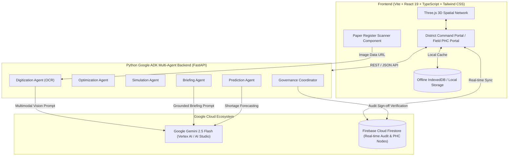

# 🏥 HealthGrid — Smart Health & Supply Chain Resilience System

> **Submitted for Code for Communities 2.0 Hackathon**  
> **Track:** *Smart Health & Supply Chain Resilience*  
> **Powered by:** Google Gemini 2.5 Flash, Google Agent Development Kit (ADK), Vertex AI, & Firebase Cloud Firestore

---

## 📌 Executive Summary

**HealthGrid** is an intelligent, multi-agent public healthcare logistics and clinical decision-support ecosystem built specifically for **Primary Health Centres (PHCs)** and **Community Health Centres (CHCs)** in resource-constrained rural district ecosystems (such as Chandrapur, Wardha, and Gadchiroli).

By combining **Google ADK multi-agent AI**, **Gemini 2.5 Flash Multimodal Vision**, **offline-first local logging**, **3D spatial route visualization**, **federated privacy-preserving surveillance**, and **human-in-the-loop officer governance**, HealthGrid ensures zero stock-outs during seasonal epidemic surges while maintaining strict data privacy and administrative compliance.

---

## 🎯 Problem Statement & Impact Context

In rural Indian public healthcare systems:
1. **Seasonal Surge Shortages:** Seasonal outbreaks (e.g., Dengue, Malaria, Acute Respiratory Infections) lead to sudden, catastrophic stock-outs of essential medicines (IV Saline, Paracetamol, ORS, Antimalarials) at ground-level PHCs within 24–48 hours.
2. **Paper Register Bottlenecks:** PHCs predominantly rely on handwritten ledger register logbooks. Digitizing supply receipts and stock dispatches manually is error-prone and severely delayed.
3. **Connectivity Gaps:** Rural PHC sub-centres frequently operate in low-bandwidth or offline environments where cloud-only web tools fail.
4. **Lack of Grounded Multi-Facility Visibility:** Central warehouse depots often lack real-time predictive visibility into which specific rural PHC clusters will run out of stock next, leading to uncoordinated dispatches.
5. **AI Accountability Concerns:** Purely autonomous AI dispatches are unacceptable in government public health administration; officers demand grounded evidence, multilingual briefs, and strict human authorization.

---

## 🌟 Key Features & Core Innovations

### 1. 🤖 Google ADK Multi-Agent Intelligence Architecture
HealthGrid deploys six specialized AI agents powered by the **Google Agent Development Kit (ADK)** and **Gemini 2.5 Flash**:

*   **`PredictionAgent`**: Uses quantile probabilistic forecasting to project stock-out risk, hours remaining until stock depletion, and patient footfall surge rates during disease spikes.
*   **`OptimizationAgent`**: Evaluates regional donor warehouse buffers and calculates optimal inter-facility stock rebalancing routes without depleting donor reserve safety margins.
*   **`SimulationAgent`**: Runs counterfactual stress-test simulations incorporating real-time hazard delays (e.g., monsoon road blockages, landslide route disruptions).
*   **`BriefingAgent`**: Generates grounded, hallucination-free executive decision briefs for District Health Officers (DHOs) in **5 Indian regional languages** (*English, Hindi, Marathi, Gujarati, Odia*).
*   **`DigitizationAgent` (Multimodal Vision OCR)**: Extracts handwritten paper register logbook entries directly into structured JSON ledgers using **Gemini 2.5 Flash Multimodal Vision**.
*   **`GovernanceCoordinator`**: Enforces policy constraints (e.g., mandatory 14-day post-transfer donor buffer) and verifies cryptographic digital sign-offs by human officers before dispatches occur.

---

### 2. 🌐 Interactive 3D Spatial Network Visualizer (`Three.js`)
*   Immersive WebGL 3D network topology representing district health facilities, regional warehouses, and active supply corridors.
*   Visual status coding:
    *   🟢 **Normal Operational Buffer** (>14 days)
    *   🟡 **Moderate Supply Warning** (5–14 days)
    *   🔴 **Critical Stock-out Imminent** (<48 hours)
*   Dynamic animated supply transit lines showing real-time rebalancing truck routes.

---

### 3. 📱 Offline-First Field Logger (PHC Nurse Persona)
*   Equipped with local caching (`IndexedDB` / `localStorage`) for seamless vitals screening and stock recording in zero-connectivity areas.
*   Automatic background data synchronization as soon as cellular connectivity is restored.

---

### 4. 🔒 Federated Privacy-Preserving Health Surveillance Panel
*   Enables multi-district disease outbreak monitoring across PHC nodes without centralizing identifiable patient medical records.
*   Applies local differential privacy noise to aggregate regional symptom counts while accurately detecting early epidemic clusters.

---

### 5. 📜 Immutable Audit Ledger & Firebase Real-Time Synchronization
*   Backed by **Google Firebase Cloud Firestore** real-time snapshot listeners.
*   Strict append-only audit trail (`audit_ledger`) recording all system events, AI predictions, and human officer dispatches for auditing and accountability.

---

## 📐 System Architecture



---

## 🛠️ Technology Stack

| Domain | Technology / Library | Purpose |
| :--- | :--- | :--- |
| **AI Framework** | Google Agent Development Kit (ADK) | Python agent orchestration and workflow management |
| **AI Foundation Model** | `@google/genai` (Gemini 2.5 Flash) | Multimodal OCR, localized briefings, shortage forecasting |
| **Frontend Framework** | React 19 + TypeScript + Vite | Modern UI, responsive layout, fast client-side rendering |
| **Styling** | Tailwind CSS v4 + Lucide Icons | Premium glassmorphism design system & icon set |
| **3D Graphics** | Three.js (`@types/three`) | Interactive 3D spatial network and route map |
| **Backend Framework** | Python 3.11 + FastAPI + Pydantic | Agent REST API endpoints, CORS support, type validation |
| **Database & Realtime** | Google Firebase Firestore v12 | Real-time state updates, node statuses, immutable audit log |

---

## 📂 Repository Directory Structure

```
code_for_communites_heath_track/
├── backend/                      # Python Google ADK Multi-Agent Backend
│   ├── agents/                   # Agent implementations
│   │   ├── adk_base.py           # ADK Base Agent class definition
│   │   ├── prediction_agent.py   # Shortage & outbreak risk prediction
│   │   ├── optimization_agent.py # Stock rebalancing linear optimization
│   │   ├── simulation_agent.py   # Counterfactual route hazard simulation
│   │   ├── briefing_agent.py     # Grounded multi-lingual briefing generator
│   │   ├── digitization_agent.py # Paper register Multimodal Vision OCR
│   │   └── governance_coordinator.py # Policy enforcement & sign-off
│   └── main.py                   # FastAPI server entry point
├── src/                          # React Frontend Application
│   ├── components/               # UI Components & View Panels
│   │   ├── DistrictDashboard.tsx # DHO District Command view & metrics
│   │   ├── Network3D.tsx         # Three.js 3D spatial facility visualizer
│   │   ├── OfflinePhcLogger.tsx  # Field PHC vitals logger (offline-first)
│   │   ├── GroundedBriefingCard.tsx # Gemini multilingual briefing card
│   │   ├── PaperRegisterScanner.tsx # Handwritten logbook OCR scanner
│   │   ├── FederatedPanel.tsx    # Privacy-preserving health surveillance
│   │   ├── HumanApprovalModal.tsx# DHO Digital sign-off modal
│   │   ├── SimulationRunner.tsx  # Counterfactual stress test UI
│   │   ├── TransferModal.tsx     # Inter-facility stock dispatch modal
│   │   ├── WarehouseLogisticsView.tsx # Central warehouse buffer management
│   │   └── FacilityDetailModal.tsx   # Detailed PHC node inspector
│   ├── data/                     # Initial mock data & geographic coordinates
│   ├── firebase/                 # Firebase SDK integration & Firestore handlers
│   ├── services/                 # Gemini AI Service & Backend API client
│   │   ├── geminiService.ts      # Direct & fallback Gemini 2.5 Flash calls
│   │   └── apiService.ts         # ADK FastAPI backend connection
│   ├── types.ts                  # Shared TypeScript interfaces & types
│   ├── App.tsx                   # Main layout, state container, role switching
│   └── index.css                 # Custom glassmorphism CSS & Tailwind imports
├── firebase-blueprint.json       # Firebase Architecture schema definition
├── firebase-applet-config.json   # Firebase client configuration
├── firestore.rules               # Security & immutable audit ledger rules
├── package.json                  # Node.js dependencies & scripts
├── vite.config.ts                # Vite build configuration
└── README.md                     # Comprehensive project documentation
```

---

## ⚡ Quick Start & Local Setup Guide

### Prerequisites
* **Node.js**: v18.0.0 or higher
* **Python**: v3.10 or higher
* **Google Gemini API Key**: Obtainable from [Google AI Studio](https://aistudio.google.com/)

---

### Step 1: Clone the Repository & Configure Environment

```bash
git clone https://github.com/your-org/healthgrid.git
cd healthgrid
```

Create a `.env` file in the root directory (or copy from `.env.example`):

```env
VITE_GEMINI_API_KEY=your_google_gemini_api_key_here
VITE_API_BASE_URL=/api
```

---

### Step 2: Install & Launch Frontend

```bash
# Install frontend dependencies
npm install

# Start Vite development server
npm run dev
```

The frontend will start locally at **`http://localhost:3000`**.

---

### Step 3: Launch Python ADK Backend (Optional for full ADK API agent endpoints)

```bash
# Navigate to project root and set up virtual environment
python -m venv venv

# Activate virtual environment
# Windows:
venv\Scripts\activate
# Linux/macOS:
source venv/bin/activate

# Install backend dependencies
pip install fastapi uvicorn pydantic google-genai

# Start FastAPI server
uvicorn backend.main:app --reload --port 8000
```

The ADK Backend API documentation will be accessible at **`http://localhost:8000/docs`**.

---

## 🎮 Hackathon Interactive Demo Walkthrough

Judges can follow this quick interactive scenario inside the running app to experience the full end-to-end workflow:

1. **Open Command Portal (`DHO Persona`):**
   * View the **District Command Dashboard** and **Interactive 3D Network**.
   * Observe **PHC Ballarpur** in Chandrapur District showing a critical stock depletion warning.

2. **Trigger Dengue Outbreak Shock (Scenario Simulation):**
   * Click **"Simulate Dengue Surge"** in the top control bar.
   * Observe patient footfall surge by +340%, triggering an immediate predicted stock-out within **42.5 hours**.

3. **Generate Grounded Multilingual Briefing:**
   * Review the **Gemini Grounded Briefing Card**.
   * Switch languages between **English**, **Hindi (हिंदी)**, and **Marathi (मराठी)** to see instant localized operational decision briefs preserving strict numerical accuracy.

4. **Run Route Hazard Counterfactual Simulation:**
   * Navigate to the **Simulation Runner** tab.
   * Toggle **"NH-347 Highway Blockage (Monsoon Landslide)"** to see the `SimulationAgent` re-evaluate delivery ETAs and risk probabilities in real-time.

5. **Execute Human-in-the-Loop Officer Approval:**
   * Click **"Authorize Rebalance Transfer"**.
   * The **Human Approval Modal** presents the verification summary, confirming that **Wardha Depot** will maintain a safe 18.5-day buffer post-transfer.
   * Click **"Sign & Dispatch 1,200 Units"** to record an immutable entry into the Firebase Audit Ledger.

6. **Scan Handwritten Paper Register (`Nurse Persona`):**
   * Switch to the **PHC Field Logger** tab and click **Paper Register Scanner**.
   * Upload or test a photo of a handwritten ledger to see **Gemini 2.5 Flash Multimodal Vision** convert raw handwritten table rows into verified digital inventory items.

---

## 🤝 Alignment with Code for Communities 2.0 Hackathon Goals

* **Targeted Public Need:** Tackles rural health facility stock-outs in Tier-2/Tier-3 district networks across India.
* **Technology Leadership:** Showcases advanced integration of Google AI technologies including **Gemini 2.5 Flash**, **Google ADK**, **Vertex AI**, and **Firebase**.
* **Scalable Governance:** Bridges cutting-edge AI capability with human officer accountability, auditability, and offline-first operational reality.

---

## 📄 License

This project is licensed under the **MIT License** — see the [LICENSE](LICENSE) file for details.

---

<p align="center">
  <i>Built with ❤️ for <b>Code for Communities 2.0 Hackathon — Smart Health & Supply Chain Resilience Track</b></i>
</p>